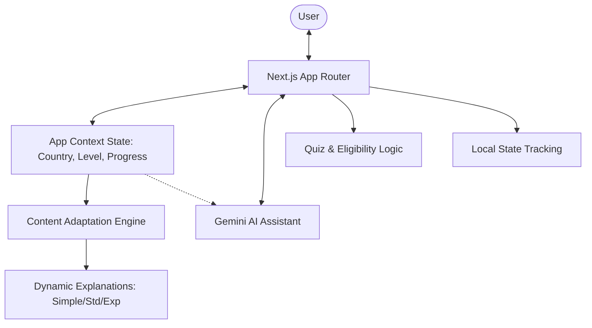
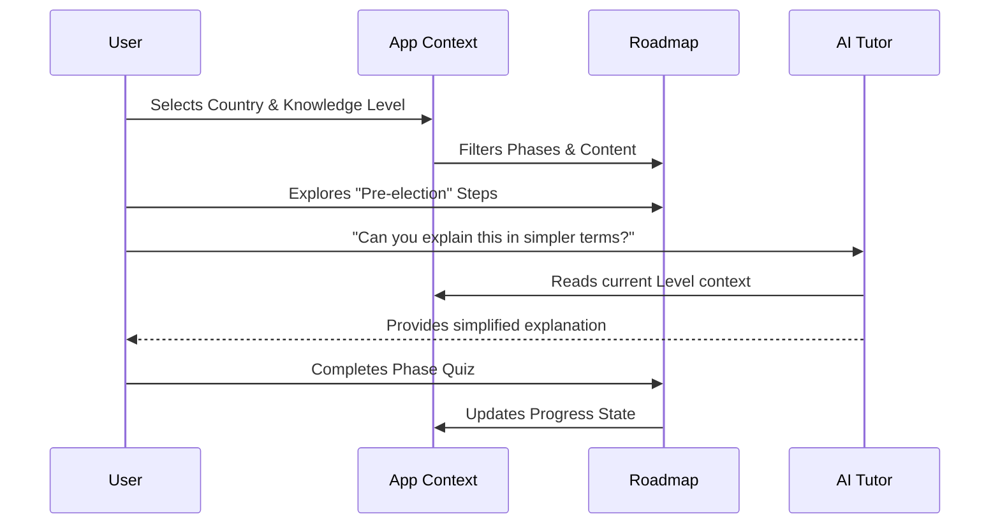

# 🗳️ ElectionEd - Interactive Civic Education Platform

> **Demystifying the democratic process through interactive storytelling and AI-powered personalization.**
>
> 🌐 **Live Demo:** [https://election-ed-913686647554.us-central1.run.app/](https://election-ed-913686647554.us-central1.run.app/)

---

ElectionEd is a next-generation civic education platform designed to make the complex world of elections accessible to everyone. By combining **interactive roadmaps**, **multi-level content adaptation**, and **real-time AI assistance**, it transforms passive learning into an engaging, gamified journey.

## 🎯 The Vision: Deep Engagement
ElectionEd tackles the "complexity barrier" of civic participation. We believe that understanding how to vote shouldn't feel like reading a legal manual. Our solution focuses on:
*   **Clarity**: Breaking down the process into digestible phases.
*   **Personalization**: Adapting to the user's knowledge level and region.
*   **Reinforcement**: Using active recall through quizzes and flashcards.

## 💡 Core Features 

### 1. 🎓 Multi-Level Explainer System (Simple, Standard, Expert)
One of the most unique aspects of ElectionEd is its **Content Adaptation Engine**. Users can toggle between three proficiency levels:
*   **🌱 Simple**: Focuses on core concepts with minimal jargon. Perfect for first-time voters or students.
*   **⚖️ Standard**: Provides a balanced overview with common terminology.
*   **🧠 Expert**: Deep dives into the nuances, legal framework, and technical aspects (e.g., VVPAT mechanisms, constitutional provisions).

### 2. 🗺️ Interactive Election Roadmap
The roadmap transforms a static timeline into a dynamic journey.
*   **Phase-Based Learning**: Moves from "Pre-election" (Registration/Voter ID) to "Post-election" (Counting/Results).
*   **Progress Tracking**: Visual markers indicate which phases have been completed via quizzes.
*   **Visual Continuity**: Uses a timeline-based UI that keeps the user oriented.

### 3. 📋 Smart Eligibility Checker
A dedicated tool that allows users to instantly verify their voting rights.
*   **Contextual Rules**: The logic updates dynamically based on the selected country (e.g., US vs. India).
*   **Instant Feedback**: Provides clear results with specific notes on residency and age requirements.

### 4. 🎮 Gamification Engine
*   **Interactive Quizzes**: Each phase ends with a knowledge check to reinforce learning.
*   **3D-Animated Flashcards**: High-quality, interactive cards for learning complex glossary terms on-the-fly.
*   **Floating Beads Visuals**: A unique, alive UI background that makes the experience feel premium and modern.

### 5. 🤖 Context-Aware AI Assistant (Gemini 1.5 Pro)
The "ElectionEd Assistant" isn't just a generic bot; it's a **contextually-aware tutor**.
*   **Inherits State**: It automatically knows your selected country and proficiency level.
*   **Adaptive Tone**: If you are in "Simple" mode, the AI simplifies its language; in "Expert" mode, it provides detailed citations and technical data.

## 🛠️ Tech Stack & Architecture

| Category | Technology | Rationale |
| :--- | :--- | :--- |
| **Framework** | Next.js (App Router) | For SEO, performance, and robust routing. |
| **State Management** | React Context API | Manages global state for Country, Level, and Progress. |
| **AI Integration** | Vercel AI SDK + Gemini 1.5 Pro | Industry-leading generative AI for educational tutoring. |
| **Animations** | Framer Motion | Smooth transitions and playful micro-interactions. |
| **Styling** | Tailwind CSS (v4) & shadcn/ui | Modern, utility-first styling for a premium aesthetic. |

### System Architecture

## 🏗️ User Flow: The Educational Journey

## 🚀 Future Roadmap
- [ ] **Multi-language Support**: Expanding beyond English to regional languages.
- [ ] **Voice-Activated Learning**: Hands-free interaction for better accessibility.
- [ ] **Offline-First Mode**: PWA support for users in low-connectivity areas.

---
Built with ❤️ for the **Hack2Skill - PromptWars** Hackathon.
This project represents a commitment to democratizing civic knowledge using cutting-edge AI and interactive design.
