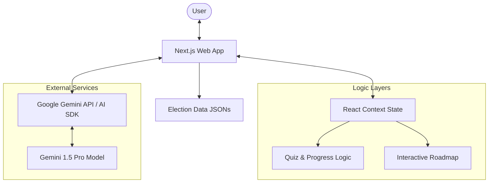
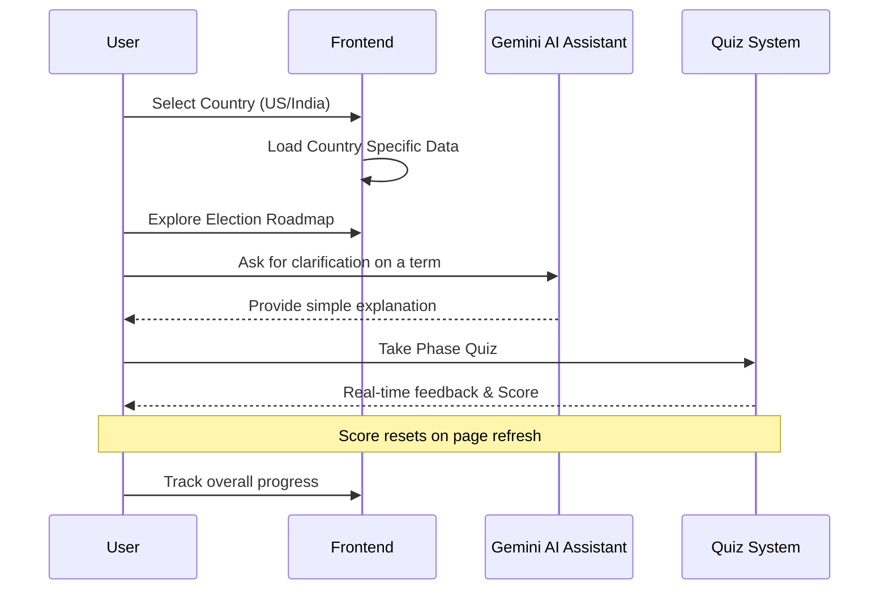

# 🗳️ ElectionEd - Election Process Education Assistant

> **Empowering citizens through interactive civic education.**
>
> 🌐 **Live Demo:** [https://election-ed-913686647554.us-central1.run.app/](https://election-ed-913686647554.us-central1.run.app/)

---

ElectionEd is a vibrant, interactive web application designed to demystify the election process. It provides a clear, step-by-step, conversational journey through electoral systems, making civic education accessible and engaging for everyone.

## 🎯 Chosen Vertical
**Election Process Education Assistant**
We chose this vertical to tackle the complexity of civic education. Many citizens find electoral processes daunting. This assistant demystifies voting procedures, eligibility, and election timelines using an interactive, gamified, and AI-assisted approach.

## 💡 Approach and Logic
Our approach is centered on making civic education **interactive**, **personalized**, and **accessible**.

*   **🌍 Contextual Adaptation**: Tailors content based on the selected country (e.g., US, India).
*   **Roadmap**: Uses an interactive election roadmap to break down complex timelines into digestible phases (Pre-election, Campaign, Voting, Post-election).
*   **🎮 Gamification**: Interactive quizzes at the end of each phase to test and reinforce knowledge.
*   **🤖 AI-Driven Personalization**: Integration of the **Google Gemini API** as a "VoteGuide AI assistant" to explain concepts on-the-fly, adapting to different proficiency levels (Simple, Standard, Expert).

## 🛠️ Tech Stack

| Category | Technology |
| :--- | :--- |
| **Framework** | Next.js (App Router) |
| **Language** | TypeScript |
| **Styling** | Tailwind CSS & shadcn/ui |
| **Animations** | Framer Motion & Canvas-Confetti |
| **AI Integration** | Google Gemini API via Vercel AI SDK |
| **Deployment** | Google Cloud Run & Docker |

## 🏗️ Application Architecture



## 🔄 User Flow



## 🚀 How the Solution Works
*   **Frontend**: Built with Next.js (App Router) for a lightning-fast experience. The UI uses **Framer Motion** for smooth transitions and **shadcn/ui** for a premium look.
*   **AI Integration**: Securely communicates with the **Gemini 2.5 Pro** model to provide context-aware explanations on voting steps, EVMs, VVPATs, and more.
*   **Dynamic Content**: Country-specific processes are managed via structured JSON files, allowing for easy updates and expansion to other regions.

## 📝 Assumptions Made
*   Users have basic internet connectivity and use a modern web browser.
*   Election laws and procedures are based on national guidelines; local nuances may require further specific resources.
*   The solution provides educational overviews rather than legally binding advice.

## 🛠️ Getting Started

1.  **Clone the repository**:
    ```bash
    git clone https://github.com/himashrik/Election-process-education
    ```
2.  **Install dependencies**:
    ```bash
    npm install
    ```
3.  **Set up Environment Variables**:
    Add your `GOOGLE_GENERATIVE_AI_API_KEY` to a `.env.local` file.
4.  **Run locally**:
    ```bash
    npm run dev
    ```

---
Built with ❤️ for the Election Ed Hackathon.
